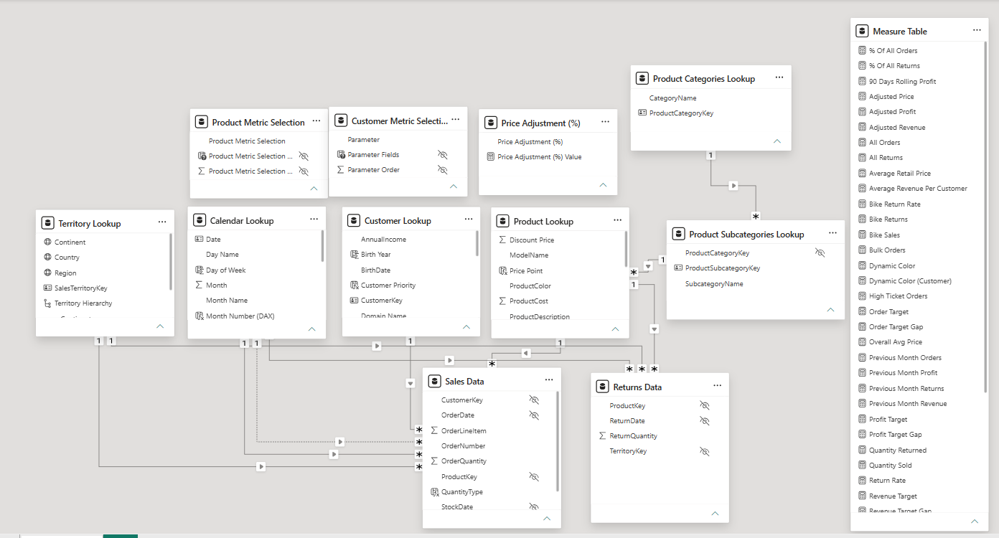
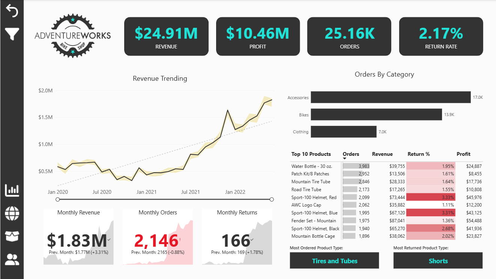
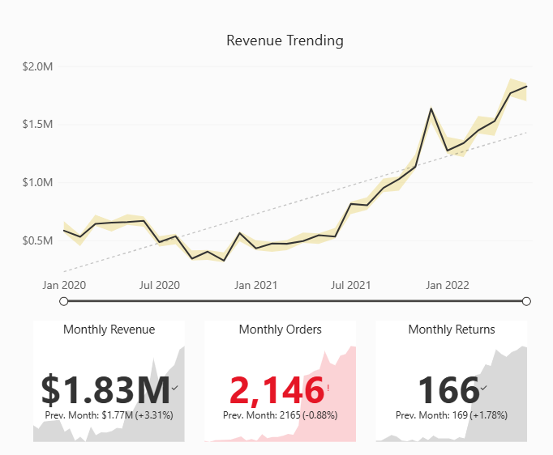
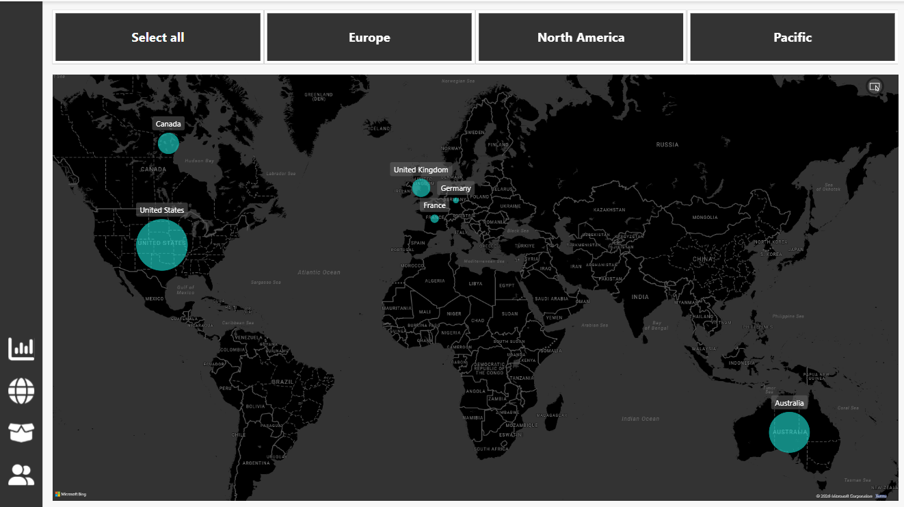
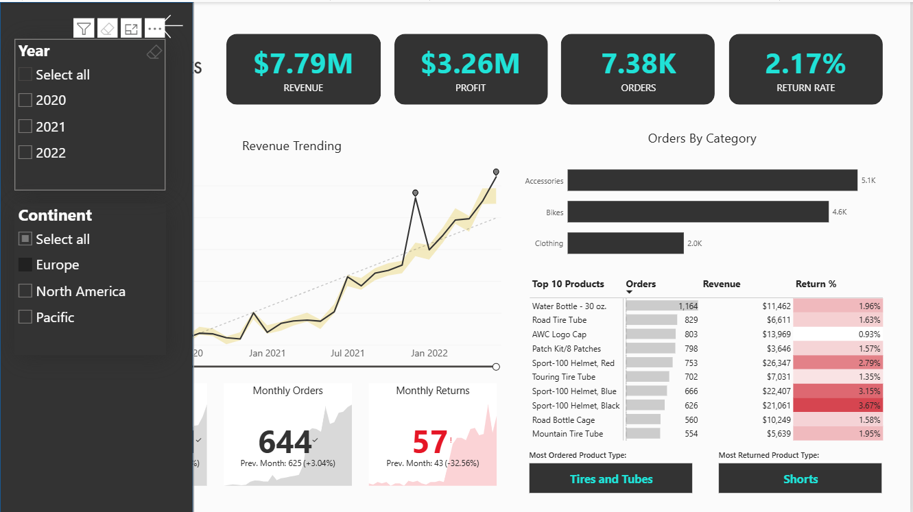
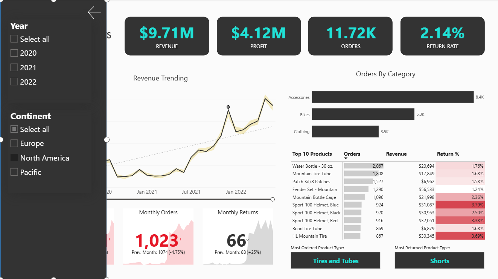
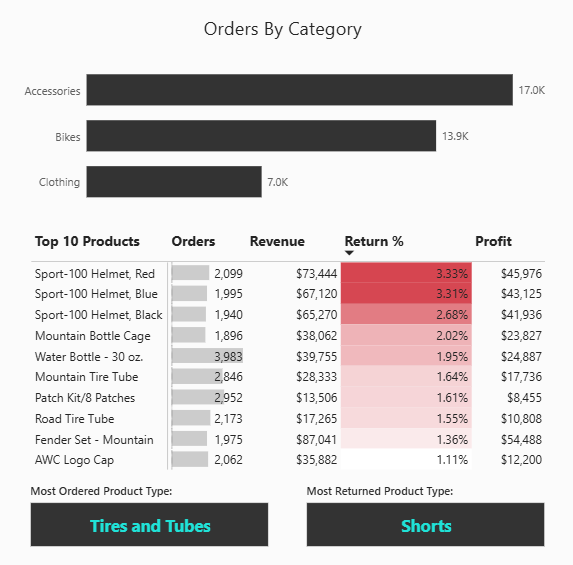
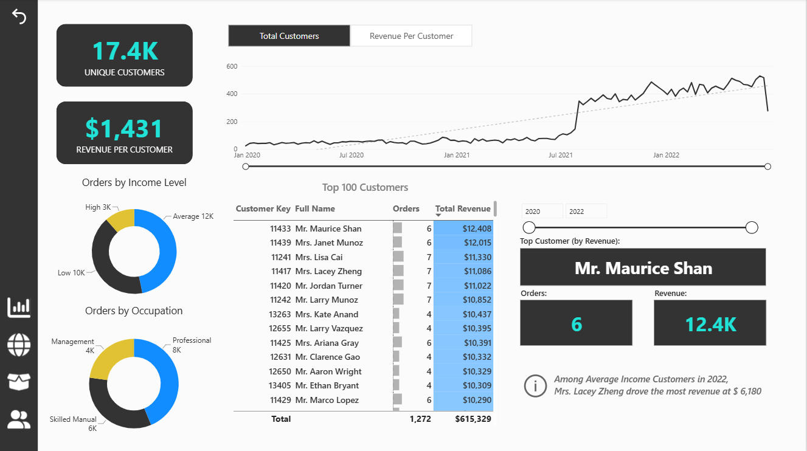

# Adventure Works Business Performance Analysis

> **Course Project:** This project was completed as part of the **Microsoft Power BI course by Maven Analytics**.
> It is a coursework project focused on analyzing business performance and building an interactive Power BI dashboard.

## Project Background

Adventure Works is a global manufacturing company that produces cycling equipment and accessories. The company operates across multiple regions and offers a range of products across different categories.

This project analyzes Adventure Works' business data to provide a clear view of its sales and overall business performance, with a focus on regional, product, and customer trends.

Insights and recommendations are provided on the following key areas:

- **Business Performance:** Track overall sales, revenue, profit, returns, and key performance indicators to understand how the business is performing over time.
- **Regional Performance:** Compare sales and profitability across regions to identify strong-performing and underperforming markets.
- **Product Performance:** Analyze product, subcategory, and category trends to identify top performers, underperforming products, and return patterns.
- **Customer Value:** Identify high-value customers and understand their contribution to overall sales and revenue.

Interactive Power BI dashboard exploring Adventure Works’ business performance and key trends [link].

# Data Structure & Initial Checks

The Adventure Works data model consists of 8 core tables: 2 fact tables (Sales Data, Returns Data) and 6 lookup tables. A description of each table is as follows:

- **Sales Data:** Order-level transactions, including order date, stock date, order number, line item, quantity, and keys linking to the customer, product, and territory.
- **Returns Data:** Returned products, including return date, quantity, and keys linking to the product and territory.
- **Customer Lookup:** Customer details such as name, birth date, marital status, gender, education, occupation, annual income, and email.
- **Product Lookup:** Product details such as SKU, name, model, color, style, cost, and price.
- **Product Subcategories Lookup / Product Categories Lookup:** The product hierarchy (product → subcategory → category).
- **Territory Lookup:** Sales regions, countries, and continents.
- **Calendar Lookup:** Date table used for time-based analysis.

### Data Preparation in Power Query

Source CSV files were ingested into Power BI, then cleaned and transformed in Power Query before data modeling:

* **All tables (schema standardization):** Promoted the first row to headers and enforced data types (date, whole number, text, currency) to ensure consistent aggregation and reliable table relationships.
* **Sales Data (data consolidation):** Ingested the sales files from a folder and appended them into a single fact table using Power Query's combine-files function, then removed the helper `Source.Name` column.
* **Customer Lookup (data cleansing and feature engineering):** Removed rows with errors and null or blank values in `CustomerKey` to protect key integrity. Standardized text casing across the name fields, created a concatenated `Full Name` field, and parsed the email address to extract a `Domain Name` field (hyphens replaced with spaces).
* **Product Lookup (data cleansing and derived columns):** Converted `ProductCost` and `ProductPrice` to currency, dropped the unused `ProductSize` column, replaced placeholder `0` values in `ProductStyle` with `NA`, extracted `SKU Type` from the SKU, and created a calculated `Discount Price` column (10% below `ProductPrice`).
* **Calendar Lookup (date dimension):** Created derived date attributes (day name, month name and number, year, and start-of-week, month, quarter and year fields) to support time-series analysis and trend reporting.
* **Remaining lookup tables and Returns Data:** Header promotion and data type enforcement only.

## Executive Summary

#### Overview of Findings

Adventure Works generated **$24.91M in revenue and $10.46M in profit**, with 25,164 orders and an overall return rate of 2.17%. North America was the largest revenue-generating region, while Bikes contributed the majority of revenue and profit but also had a higher return rate than the overall business. Customer analysis revealed a decline in revenue per customer across the selected periods, from $2,435 in 2020 to $875 in the first half of 2022.

## Insights Deep Dive

#### 1. Business Performance

**Revenue grew by approximately 45.6% from 2020 to 2021.** Revenue increased from $6.40M in 2020 to $9.32M in 2021, indicating stronger revenue performance in 2021.

**Revenue remained strong in the first half of 2022.** Revenue reached approximately $9.19M between January and June 2022, close to the full-year 2021 figure. However, the periods cover different lengths of time and should not be compared directly.

**The overall business recorded $10.46M in profit.** Against total revenue of $24.91M, this represents a profit margin of approximately 42.0%, based on the dashboard's revenue and profit measures.

**June 2022 revenue increased while order volume declined slightly.** Revenue increased by 3.31% compared with the previous month, while orders decreased by 0.88%. This difference suggests that order volume alone may not explain revenue movements; average order value and product mix would need further investigation.

#### 2. Regional Performance

**North America was the leading region.** It generated $9.71M in revenue and $4.12M in profit, with approximately 11.72K orders. The United States contributed $7.94M in revenue and $3.36M in profit, accounting for most of the region's revenue.

**The United Kingdom led the European countries shown by revenue.** The UK generated approximately $2.90M in revenue and $1.21M in profit, followed by Germany at $2.52M in revenue and France at $2.36M.

**Pacific recorded the highest regional return rate.** Its return rate was 2.25%, compared with 2.17% in Europe and 2.14% in North America. The figures identify a difference worth investigating, but do not establish why Pacific's rate is higher.

**Monthly revenue trends differed across regions.** Europe recorded a 13.91% increase and Pacific a 10.56% increase compared with the previous month, while North America declined by 7.55%. These differences indicate that short-term performance varied across the regions.

  <table>
    <tr>
      <td align="center" width="33%">
        
         
        <strong>Europe</strong>
      </td>
      <td align="center" width="33%">
        
         
        <strong>North America</strong>
      </td>
      <td align="center" width="33%">
        
         
        <strong>Pacific</strong>
      </td>
    </tr>
  </table>

#### 3. Product Performance

**Bikes generated the majority of revenue and profit.** The category contributed approximately $23.64M in revenue and $9.73M in profit, substantially exceeding Accessories and Clothing. This makes Bikes the largest contributor to the overall financial results.

**Bikes also recorded the highest category return rate.** At 3.08%, the rate was above the overall business return rate of 2.17%. Given the category's revenue contribution, understanding the reasons behind these returns is important.

**Accessories had the lowest category return rate.** Accessories generated approximately $906.7K in revenue and $569.8K in profit, with a return rate of 1.95%. Clothing generated $365.4K in revenue and $161.8K in profit, with a return rate of 2.16%.

**Some individual products had return rates above the business average.** Sport-100 Helmet Red recorded a 3.33% return rate and Sport-100 Helmet Blue recorded 3.31%, compared with the overall rate of 2.17%. Meanwhile, Fender Set - Mountain generated $87,041 in revenue and $54,488 in profit among the products displayed in the Top 10 table.

#### 4. Customer Value

**The number of customers represented in the selected periods increased.** The dashboard showed approximately 2.6K customers in 2020, 9.1K in 2021, and 10.5K in January–June 2022. These are period-filtered customer counts, not necessarily counts of newly acquired customers.

**Revenue per customer declined across the selected periods.** It decreased from $2,435 in 2020 to $1,021 in 2021 and $875 in the first half of 2022. This indicates lower revenue per customer in the later periods, although the partial-year comparison should be interpreted carefully.

**Customer count and revenue per customer moved in different directions.** The customer count was higher in the later selected periods, while revenue per customer was lower. Purchase frequency, average order value, and product mix are potential areas to investigate to understand the decline in revenue per customer.

**Professional customers had the highest displayed order count by occupation.** The chart showed approximately 8K orders for Professionals, 6K for Skilled Manual customers, and 4K for Management customers. Average-income customers had the highest displayed order count among the income groups. These figures describe order distribution, not profitability by segment.

**Maurice Shan was the highest-revenue customer highlighted in the overall customer view.** The dashboard displayed approximately $12.4K in revenue across six orders, illustrating how the Top 100 Customers table can be used to explore individual customer contributions.

## Recommendations

Based on the findings above, the following actions are recommended:

- **Reduce returns in the Bikes category.** Investigate the main reasons for the 3.08% return rate in Bikes, which is higher than the overall rate of 2.17%. Prioritize corrective actions for products with recurring return issues to improve customer satisfaction and protect profitability.

- **Build on revenue growth by identifying successful sales drivers.** Compare order volume, average order value, and product mix across 2020 and 2021 to identify which contributed most to revenue growth. Use these findings to guide future sales campaigns and product promotions.

- **Strengthen regional sales strategies.** Continue supporting North America, the largest revenue-generating region, while identifying opportunities to increase sales in Europe and Pacific. Review Pacific's higher return rate and prioritize products or markets where improvements could reduce returns.

- **Increase repeat purchases and customer spending.** Investigate the decline in revenue per customer and develop targeted retention campaigns, personalised offers, and complementary-product recommendations to encourage repeat purchases and increase average order value.

- **Improve the performance of high-return products.** Review customer feedback and return reasons for Sport-100 Helmet Red and Blue, whose return rates exceed 3.3%. Based on the findings, consider improvements to product quality, product descriptions, sizing information, or customer guidance to reduce avoidable returns.

- **Expand sales of profitable products.** Use the strong performance of Fender Set - Mountain, which generated $87,041 in revenue and $54,488 in profit among the displayed Top 10 products, to inform product placement, promotions, and cross-selling strategies. Evaluate whether similar opportunities exist for other profitable products.

